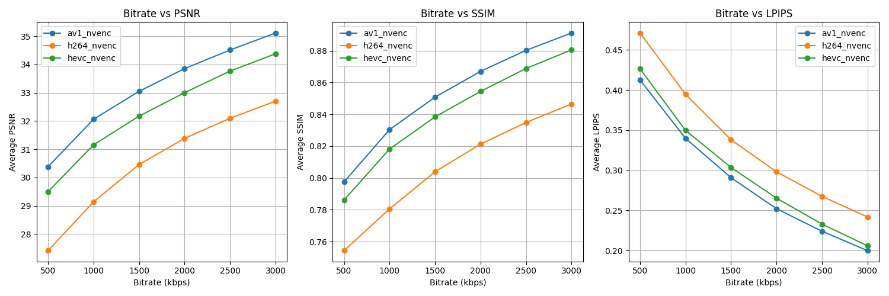

# 视频编码与通信实验

本项目旨在对不同视频编码器（AV1、H.264、HEVC）在不同码率下的性能进行对比分析，包括质量指标（PSNR、SSIM、LPIPS）的计算与可视化。

---

## 📁 项目结构

```
videolab/
├── Step0_environment_check.py  # 环境检查脚本
├── Step1_video_convert.py      # 视频编码与解码脚本
├── Step2_quality_metrics.py    # 质量指标计算脚本
├── Step3_plot.py               # 数据可视化脚本
├── Step4_frame_extract_and_stitch.py  # 帧提取与拼接脚本
├── output/                     # 输出文件夹，存储中间文件和结果
└── README.md                   # 项目说明文件
```

---

## 🚀 快速开始

### 1. 环境配置

#### 安装依赖
确保已安装以下工具和库：
- **Python 3.8+**
- **CUDA Toolkit**（支持 GPU 加速）
- **FFmpeg**（支持 `h264_nvenc`、`hevc_nvenc`、`av1_nvenc` 编码器）
- **Python 库**：`torch`、`pyiqa`、`matplotlib`、`pandas`

#### 检查环境
运行 `Step0_environment_check.py` 检查环境是否正确配置：
```bash
python Step0_environment_check.py
```

---

### 2. 实验步骤

#### Step 1: 视频编码与解码
运行 `Step1_video_convert.py` 将输入视频转换为不同编码格式和比特率，并解码为 YUV 格式：
```bash
python Step1_video_convert.py
```

输出文件将保存在 `output/` 文件夹中，命名格式为：
- 编码视频：`output_{编码器}_{码率}k.mp4`
- 解码视频：`output_{编码器}_{码率}k_decoded.yuv`

#### Step 2: 计算质量指标
运行 `Step2_quality_metrics.py` 计算解码后视频的质量指标（PSNR、SSIM、LPIPS）：
```bash
python Step2_quality_metrics.py
```

结果将保存到 `output/quality_metrics.csv` 文件中。

#### Step 3: 数据可视化
运行 `Step3_plot.py` 绘制不同编码器和比特率下的质量指标对比图：
```bash
python Step3_plot.py
```

生成的图像将保存在 `output/bitrate_vs_quality_metrics_combined.png`。

#### Step 4: 帧提取与拼接
运行 `Step4_frame_extract_and_stitch.py` 从视频中提取特定帧并进行横向拼接：
```bash
python Step4_frame_extract_and_stitch.py
```

生成的拼接图像将保存在 `output/` 文件夹中，命名格式为：
- `stitched_original_h264_500k_hevc_500k_av1_500k.png`
- `stitched_h264_1000k_h264_2000k_h264_3000k.png`
- `stitched_hevc_1000k_hevc_2000k_hevc_3000k.png`
- `stitched_av1_1000k_av1_2000k_av1_3000k.png`

---

## 📊 实验结果

### 示例图表
以下是不同编码器在不同码率下的质量指标对比图：



---

## ⚙️ 环境配置指南

### 1. 安装 FFmpeg
- **macOS**: 使用 Homebrew 安装：
  ```bash
  brew install ffmpeg
  ```
- **Windows**: 从 [FFmpeg 官网](https://ffmpeg.org) 下载并配置环境变量。

### 2. 安装 CUDA 和 cuDNN
- 下载 [CUDA Toolkit](https://developer.nvidia.com/cuda-downloads) 和 [cuDNN](https://developer.nvidia.com/cudnn)，并按照官方文档安装。

### 3. 安装 PyTorch
根据你的 CUDA 版本安装 GPU 加速版本的 PyTorch：
```bash
pip install torch torchvision torchaudio --index-url https://download.pytorch.org/whl/cu118
```

---

## 📌 注意事项

1. 确保输入视频文件命名为 `input.mp4` 并放置在项目根目录。
2. 如果某些编码器不支持，请检查 FFmpeg 的安装配置是否正确。
3. 运行脚本时，请确保 `output/` 文件夹存在，或由脚本自动创建。
4. 如果没有支持 CUDA 的设备请注意你需要修改 `Step1_video_convert.py` 中的编码参数。


